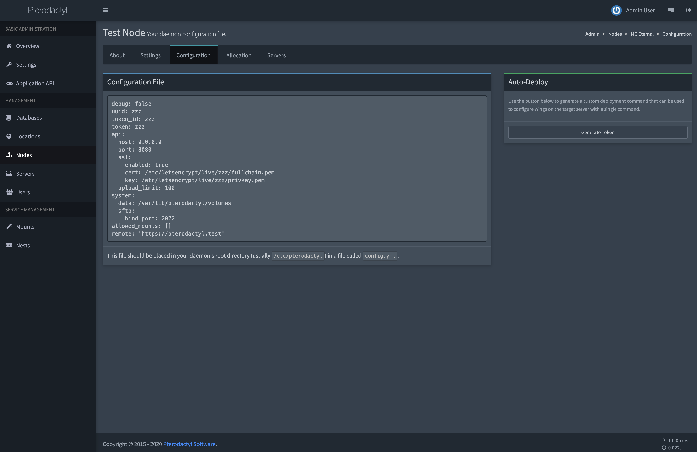
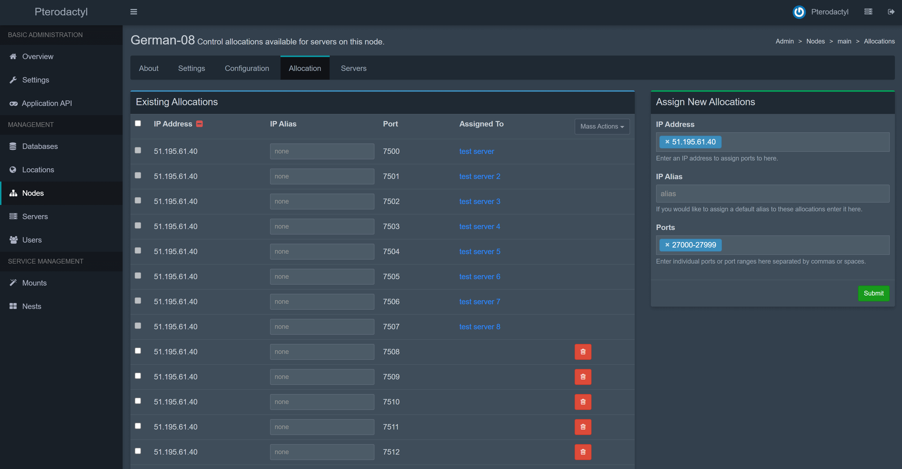

# 安装 Wings

Wings 是翼龙的下一代服务器控制平面。它已经使用 Go 从头开始重建，并从我们的第一个 Nodejs 守护进程中吸取了教训。

::: warning
只有在运行 **翼龙 1.x** 时才应安装 Wings。不要为以前版本的翼龙安装此软件。
:::

## 支持的系统

以下是支持的操作系统列表。请注意，这不是一个详尽的列表，您很有可能可以毫不费力地在其他 Linux 发行版上运行该软件。您有责任确定这些系统上可能需要哪些软件包。以下受支持操作系统的新版本也很有可能正常工作，您在安装是不仅限于以下列出的版本。

| 操作系统 | 版本 |     支持状况       | 注意事项                                                       |
|------------------|---------|:------------------:|-------------------------------------------------------------|
| **Ubuntu**       | 18.04   | :white_check_mark: | 文档基于 Ubuntu 18.04 作为操作系统所编写的。 |
|                  | 20.04   | :white_check_mark: |                                                             |
|                  | 22.04   | :white_check_mark: |                                                             |
| **CentOS**       | 7       | :white_check_mark: |                                                             |
|                  | 8       | :white_check_mark: | 请注意，CentOS 8 已停运。使用 Rocky 或 Alma Linux.         |
| **Debian**       | 10      | :white_check_mark: |                                                             |
|                  | 11      | :white_check_mark: |                                                             |
| **Windows**      | All     |        :x:         | 该软件将无法在 Windows 环境中运行。         |

## 系统要求

要运行 Wings，您需要一个能够运行 Docker 镜像的 Linux 系统。大多数 VPS 和几乎所有专用服务器都应该能够运行 Docker，但也有一些极端情况。

当您的供应商使用 `Virtuozzo`、`OpenVZ`（或 `OVZ`）或 `LXC` 虚拟化时，您很可能无法运行 Wings。一些提供商已经对嵌套虚拟化进行了必要的更改以支持 Docker。请咨询您的提供商的支持团队。KVM 保证可以工作。

最简单的检查方法是输入 `systemd-detect-virt`。
如果结果不包含 `OpenVZ` 或 `LXC`，应该没问题。当运行没有任何虚拟化的专用硬件时，将出现 `none` 的结果。

如果由于某种原因不能正常工作，或者您仍然不确定，您也可以运行以下命令。

```bash
dane@pterodactyl:~$ sudo dmidecode -s system-manufacturer
VMware, Inc.
```

## 依赖项

- curl
- Docker

### 安装 Docker

如需快速安装 Docker 社区版，您可以执行以下命令：

```bash
curl -sSL https://get.docker.com/ | CHANNEL=stable bash
# 如果速度过慢可以尝试阿里云源
curl -sSL https://get.docker.com/ | CHANNEL=stable bash -s docker --mirror Aliyun
```

如果您希望手动安装，请参考官方 Docker 文档了解如何在您的服务器上安装 Docker 社区版。下面列出了一些常用系统支持的快速链接。

- [Ubuntu](https://docs.docker.com/install/linux/docker-ce/ubuntu/#install-docker-ce)
- [CentOS](https://docs.docker.com/install/linux/docker-ce/centos/#install-docker-ce)
- [Debian](https://docs.docker.com/install/linux/docker-ce/debian/#install-docker-ce)

::: warning 检查你的内核
请注意，某些主机安装了不支持 docker 重要功能的修改内核。 请通过运行 `uname -r` 检查您的内核。 如果您的内核以 `-xxxx-grs-ipv6-64` 或 `-xxxx-mod-std-ipv6-64` 结尾，您可能使用的是不受支持的内核。 查看我们的 [内核修改](../../../daemon/0.6/kernel_modifications.md) 指南了解详细信息。
:::

#### 在启动时启动 Docker

如果您使用的是带有 systemd 的操作系统（Ubuntu 16+、Debian 8+、CentOS 7+），请运行以下命令以在您启动机器时启动 Docker。

```bash
systemctl enable --now docker
```

#### 启用虚拟内存

在大多数系统上，默认情况下 Docker 将无法设置交换空间。您可以通过运行 `docker info` 并在底部附近查找 `WARNING: No swap limit support` 的输出来确认这一点。

启用虚拟内存是完全可选的，但如果您要为他人托管并防止出现 OOM 错误，我们建议您这样做。

要启用虚拟内存，请以 root 用户身份打开 `/etc/default/grub` 并找到以 `GRUB_CMDLINE_LINUX_DEFAULT` 为开头的一行。确保该行在双引号内的某处包含 `swapaccount=1`。

之后，运行 `sudo update-grub` 然后运行 `sudo reboot` 重启服务器并启用虚拟内存。
下面是该行内容示例，_请勿逐字复制此行。 它通常具有其他特定于操作系统的参数。_

```text
GRUB_CMDLINE_LINUX_DEFAULT="swapaccount=1"
```

::: tip GRUB 配置
一些 Linux 发行版可能会忽略 `GRUB_CMDLINE_LINUX_DEFAULT`。因此，如果默认的不适合您，您可能不得不使用 `GRUB_CMDLINE_LINUX`。
:::

## 安装 Wings

安装 Wings 的第一步是确保我们已经设置了所需的目录结构。为此，请运行以下命令，这将创建基本目录并下载 wings 可执行文件。

::: danger
Wings 及配置文件路径已写死，请不要想着更改路径。（当然，你可以修改配置中的存储路径）     
并且 wings 文件和配置文件占用空间很低，在配置完设置后自行备份配置文件以防不测(如果真没了，那也是整个服务器没了吧...)。
:::

```bash
mkdir -p /etc/pterodactyl
curl -L -o /usr/local/bin/wings "https://github.com/pterodactyl-china/wings/releases/latest/download/wings_linux_$([[ "$(uname -m)" == "x86_64" ]] && echo "amd64" || echo "arm64")"
chmod u+x /usr/local/bin/wings

# 若阁下在上条指令上无法正常拉取压缩包或者拉取缓慢 可使用 gh-proxy 提供的CF反向代理来拉取
curl -L -o /usr/local/bin/wings "https://gh.api.99988866.xyz/https://github.com/pterodactyl-china/wings/releases/latest/download/wings_linux_$([[ "$(uname -m)" == "x86_64" ]] && echo "amd64" || echo "arm64")"
```

::: warning OVH/SYS 服务器
如果您使用的是 OVH 或 SoYouStart 提供的服务器，请注意您的主驱动器空间可能分配给 `/home`，而不是默认分配给 `/`。
请考虑使用 `/home/daemon-data` 来存储服务器数据。在创建节点时可以很容易地设置。
:::

## 配置

安装 Wings 和所需组件后，下一步是在已安装的面板上创建一个节点。转到您的面板管理窗口，从侧边栏中选择节点，然后在右侧单击创建新按钮。

创建节点后，单击它，将出现一个名为“配置”的选项卡。复制代码块内容，将其粘贴到 `/etc/pterodactyl` 中的一个名为 `config.yml` 的新文件中并保存。

或者，您可以单击 “生成自动部署指令” 按钮，复制 bash 命令并将其粘贴到终端中。



::: warning
当您的面板使用 SSL 时，Wings 还必须为其 域名(FQDN) 创建一个。在继续之前，请参阅 [创建 SSL 证书](/tutorials/creating_ssl_certificates.html) 文档页面了解如何创建这些证书。
:::

### 启动 Wings

要启动 Wings，只需运行以下命令，它将以调试模式启动。一旦你确认它运行没有错误，使用 `CTRL+C` 来终止进程并按照下面的说明使用守护进程。根据您服务器的互联网连接，第一次拉取和启动 Wings 可能需要几分钟时间。

```bash
sudo wings --debug
```

您可以选择添加 `--debug` 参数以在调试模式下运行 Wings。

### 守护进程（使用 systemd）

在后台运行 Wings 是一项简单的任务，只需在执行此操作之前确保它运行无误即可。将下面的内容放在 `/etc/systemd/system` 目录下的 `wings.service` 文件中。

```text
[Unit]
Description=Pterodactyl Wings Daemon
After=docker.service
Requires=docker.service
PartOf=docker.service

[Service]
User=root
WorkingDirectory=/etc/pterodactyl
LimitNOFILE=4096
PIDFile=/var/run/wings/daemon.pid
ExecStart=/usr/local/bin/wings
Restart=on-failure
StartLimitInterval=180
StartLimitBurst=30
RestartSec=5s

[Install]
WantedBy=multi-user.target
```

然后，运行以下命令重新加载 systemd 并启动 Wings。

```bash
systemctl enable --now wings
```

### 节点分配

分配是 IP 和端口的组合，您可以分配给服务器。 每个创建的服务器必须至少有一个分配。 分配将是您的网络接口的 IP 地址。 在某些情况下，例如在使用了 NAT 的情况下，它将是内部 IP。 要创建新分配，请转到节点 > 您的节点 > 分配。



输入 `hostname -I | awk '{print $1}'` 查找要用于分配的 IP。或者，您可以输入 `ip addr | grep "inet "` 查看所有可用的接口和 IP 地址。不要使用 127.0.0.1 进行分配。
